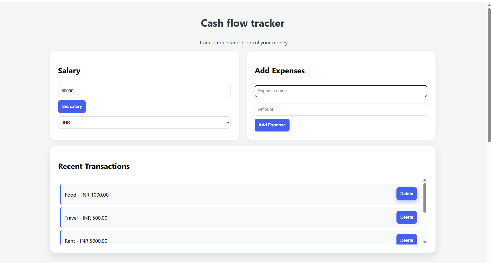
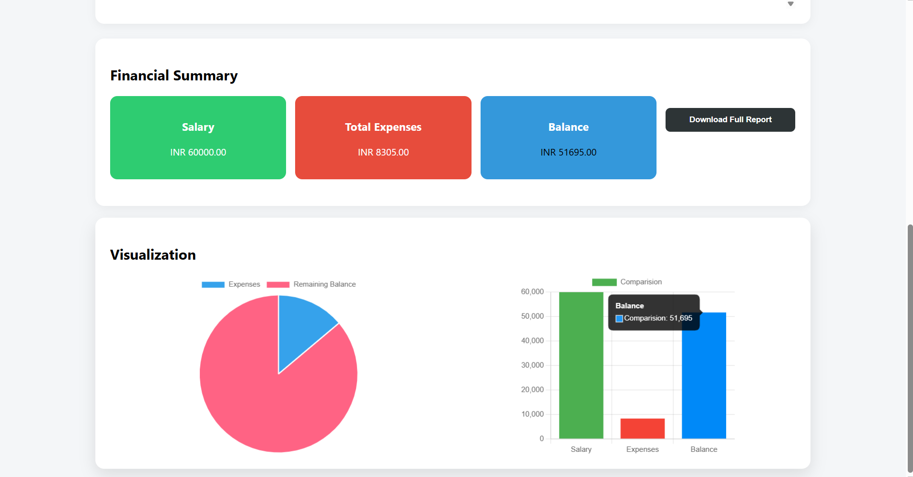
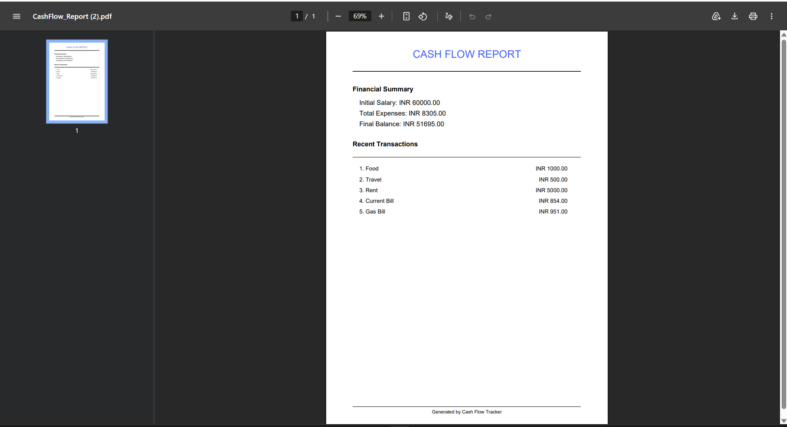
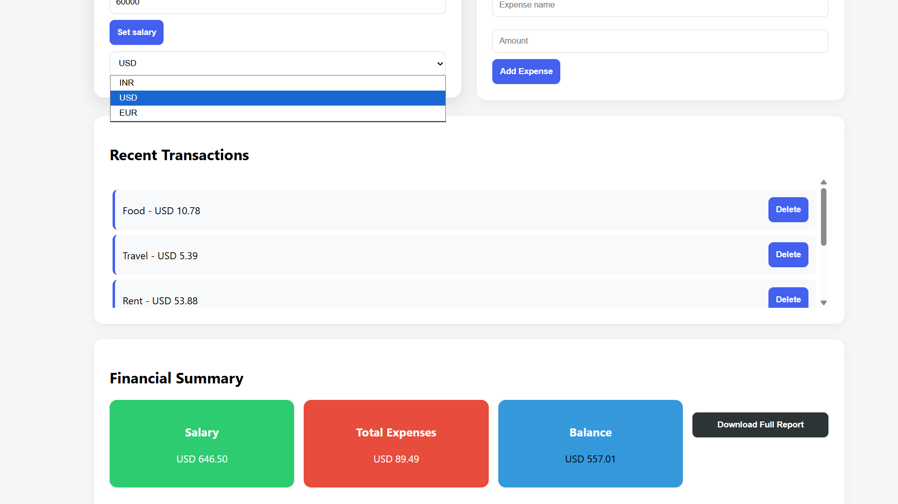

#  Cash Flow Tracker

## 📌 Overview
A responsive personal finance dashboard to track salary, expenses, and remaining balance with real-time analytics.

---

##  Features

###  Core
- Add Salary  
- Add Expenses  
- Automatic Balance Calculation  
- Input validation with user alerts  

###  Level 2
- LocalStorage persistence (data saved after refresh)  
- Delete expenses  
- Pie chart visualization (Chart.js)  
- Bar chart visualization  

###  Level 3
- Download report as PDF (jsPDF)  
- Currency converter (INR, USD, EUR)  
- Budget alert when balance drops below 10%  

---

##  Tech Stack
HTML • CSS • JavaScript • Chart.js • jsPDF  

---

## 🌐 Live Demo
*(Will be added after deployment)*  

---
## Screenshots 

---

##  How to Run
1. Open the project folder  
2. Open `index.html` in your browser  

---

## 📌 Notes
- Data is stored in browser (LocalStorage)  
- Works on both desktop and mobile  

---

##  Author
Kondreddy Geethika